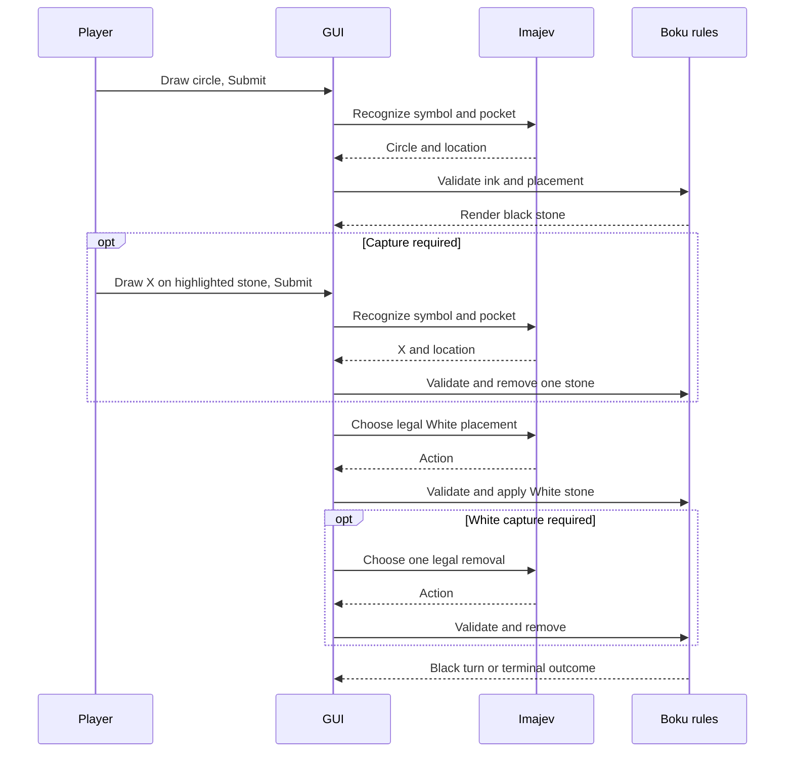

# Boku implementation

Boku is the second game in the desktop app. Draw your moves, then Submit: an accepted circle becomes a realistic black stone; an accepted X removes a highlighted white stone during a required capture. Imajev plays White through the same managed image/decision service as tic-tac-toe.

```sh
uv run --locked --offline imajev-game --config config.boku.yaml
```

Add `--debug-input` for saved sessions and inline Diagnostics. The Boku profile allows 90 seconds per model request to accommodate the larger board on slower systems; inference remains outside the GUI thread. Select Boku in the game selector before the first move to switch immediately. After play begins, select it and click New game. Every Boku game starts with human Black. Both games expose their own Move prompt and Move variety choices; switching games restores each game’s choices during the app session.

## Rules and coordinates

The implementation follows [Rules of Bōku](https://boku.bandoodle.co.uk/rules.html): 80 spaces, 36 stones each, Black first, and five **or more** adjacent stones on any of three straight axes wins. Sandwiching exactly two opposing stones requires removing **one** eligible stone and returning it to its owner's reserve. A double sandwich offers more eligible choices but still removes only one. The removed space is forbidden for the opponent's next placement only.

App conventions: finish required capture before checking results; a win takes precedence over the reserve-exhaustion draw suggestion. No repetition draw or turn limit is imposed. A placement and its capture are distinct accepted actions in the same player's turn.

Geometry uses axial coordinates `0 <= q <= 9`, `0 <= r <= 10`, `5 <= q+r <= 14`. Horizontal row letters run top to bottom; numbers run left to right within each row. The three line directions are `(1,0)`, `(0,1)` and `(1,-1)` and their opposites. This is an 80-space board, not a regular 91-space hexagon.

```text
          A1 A2 A3 A4 A5
        B1 B2 B3 B4 B5 B6
      C1 C2 C3 C4 C5 C6 C7
    D1 D2 D3 D4 D5 D6 D7 D8
  E1 E2 E3 E4 E5 E6 E7 E8 E9
F1 F2 F3 F4 F5 F6 F7 F8 F9 F10
  G1 G2 G3 G4 G5 G6 G7 G8 G9
    H1 H2 H3 H4 H5 H6 H7 H8
      I1 I2 I3 I4 I5 I6 I7
        J1 J2 J3 J4 J5 J6
          K1 K2 K3 K4 K5
```

## Drawing and rendering

Draw one circle within an empty pocket for placement. Gold rings identify eligible enemy stones when a capture is required; draw one X over one of them. A red ring marks the temporarily forbidden empty space. Undo stroke and Clear drawing edit pending ink; accepted moves cannot be undone.

Recognition magnifies a square view containing **all** pending ink and neighboring labelled pockets, with committed stones omitted so rendered stones cannot be mistaken for handwritten circles. Framing uses the complete ink bounds, never a guessed legal action; distant or multiple marks remain visible. This view uses a plain hexagonal grid rather than shaded round pockets, with IDs above the handwriting area to avoid confusing printed circles with ink or covering labels with an X. All 80 location choices plus invalid remain available. Symbol and location questions include invalid choices. Both answers must meet the configured effective probability threshold, 0.65 in the Boku profile. This was lowered from 0.85 after replaying two correctly recognized circles at E3 with effective symbol scores of 0.6922 and 0.7115; both pass at 0.65, while the logged invalid scribble and placement-phase X remain rejected. An independent length-weighted check requires at least 95% of ink within 48% of neighbor spacing from the selected pocket center. Authoritative rules then reject occupied, forbidden or ineligible targets. A rejection retains the ink for correction.

Accepted ink is retained in history but displayed as a stone. The shared scene renderer paints pockets, black/white stones, gradients, rims, shadows and phase highlights. Decision PNGs show the full symbolic position; recognition PNGs magnify the pending ink as described above. Resizing changes neither normalized ink nor observation geometry.

## State and model requests

Immutable state stores occupancy, current player, placement/capture phase, capture candidates, forbidden space, reserves, accepted history and revision. Every accepted action increments revision; the player changes only when the turn is complete. Loading replays the history and checks the entire stored state, including unfinished captures and reserve accounting.

Each computer phase asks one `move` choice question over legal action IDs (`place_<cell>` or `capture_<cell>`). Context contains the authoritative board, axial mapping, rules, reserves, prohibition and latest 12 turns. Retries retain state and choices while rephrasing the question. Abstentions and illegal decisions do not commit moves. Optional move sampling uses validated legal choices. Imajev's choice scores are preferences, not proof of tactical correctness.



## Prompt modes and coaching

Original retains Boku’s existing full-state prompt. Quoted (the default) adds the ordered rules `win immediately` and `otherwise prevent Black winning next turn`. Coached quoted starts with the same two rules and revises them after a loss only. Placement and capture requests, including retries, receive the game’s strategy snapshot. Boku does not use tic-tac-toe opening advice, tactical corrections or square-grid candidate facts.

Both quoted modes also provide Boku-specific candidate facts computed by the
authoritative rules engine: `wins_now`, `blocks_Black_win_next_turn` and
`allows_Black_win_next_turn`. The additional `allows_Black_capture_forced_win`
flag checks whether a Black placement/capture forces a win after every White
reply. This bounded extension covers capture setups, not all two-turn threats.
Immediate facts cover the completed White turn and one
completed Black reply, including mandatory captures, reserve exhaustion and
the captured-space prohibition. A placement can have several capture choices;
its aggregate flags assume White chooses a winning/safe continuation when one
exists, and `capture_options` supplies each individual branch. The subsequent
capture request evaluates its own choices. This is bounded tactical evidence,
not a search for overall game strength or an override of the model's choice.

Both quoted modes also name the winning legal actions in
`immediate_White_win_actions`, derived from the same `wins_now` facts without
additional search. The question explicitly prioritizes that list. It is empty
when no immediate win exists, remains present on retries, and identifies winning
capture choices when capture is pending. All legal candidates remain available;
Imajev still chooses the action. This representation corrected the recorded
missed A1 win in the [prompt experiment](evaluation/boku-win-priority.md).

False flags are omitted from candidate descriptions and declared once as
`candidate_fact_defaults`, with explicit scope in the prompt. This avoids
repeating three false values across up to 79 candidates. Original mode retains
plain action descriptions. Boku builds decision requests in the existing background worker so deeper
fact calculation leaves the GUI responsive. Prepared requests are recorded
on the GUI thread; resets discard stale preparations before inference.
The helpers and the bounded position-only reply cache live
under `app/games/boku/`; the shared controller and tic-tac-toe are unchanged.

Each coaching stage includes `RULES` from Boku’s implementation, the 80 cell-to-axial-coordinate mappings, alignment axes and player identities. History is reconstructed by replaying accepted placements and captures; it includes reserve accounting, eligible captures, the forbidden space and terminal state. The coach first diagnoses the loss, then revises the ordered strategy with history since the previous successful update. Long games can be summarized in ordered action segments with exact start/end checkpoints. Mandatory rules and geometry remain in every request; no history is silently dropped.

Strategies, completed games, sessions and attempts live under `learning/coached-quoted/boku/` by default, independently of the tic-tac-toe ledger. Wins and draws enter coached history but do not trigger coaching. Failed updates retain the previous strategy and offer Retry coaching or Continue; Diagnostics shows the diagnosis, requests, coverage, results and errors. Ordinary prompt modes do not record coaching history.

Game policies own prompt choices, presentation, strategy defaults and coaching context. The common controller handles drawing, background jobs, recovery and service ownership; transports know only chat messages, never game rules. Existing Boku saves that retained an unused tic-tac-toe prompt setting resume with Original. New saves retain their selected mode and strategy.

See [coaching setup and recovery](coached-quoted.md) for shared Qwen and Ollama configuration.

## Validation

`tests/test_boku.py` covers geometry, axes and overlines, sandwiches and captures, prohibition expiry, reserves, result ordering, replay tampering, recognition rejection, stone conversion, prompt/retry behavior, sampling, capture lifecycle, resume and GUI switching. `tests/test_game_separation.py` also covers code boundaries, Boku coaching, long-history reduction, game-specific settings, legacy saves and isolated strategy persistence. Existing tic-tac-toe tests remain part of the required suite.

```sh
QT_QPA_PLATFORM=offscreen uv run --locked --offline pytest -q
QT_QPA_PLATFORM=offscreen uv run --locked --offline python -m scripts.smoke_ui --game boku
QT_QPA_PLATFORM=offscreen uv run --locked --offline python -m scripts.validate_boku
QT_QPA_PLATFORM=offscreen uv run --locked --offline python -m scripts.validate_boku_coaching
```

With an existing inference service, `python -m scripts.validate_boku_tactics`
probes the recorded E5 block, a maximum-candidate opening and a mandatory
capture. It does not change the GUI game or manage processes. Results are
written to `logs/boku-tactical-facts.json`.

The live probe uses synthetic circle/X ink, makes White placement and capture decisions, checks replay, records timings and effective recognition scores, and shuts down its own service. Use `--external-inference` only for an explicitly separately managed service. It does not measure human handwriting reliability or Boku playing strength. Current live measurements are recorded in `docs/evaluation/boku.md`.

The coaching probe replays a legal scripted loss, asks the real coach to diagnose and revise rules, and checks a subsequent real Imajev decision with the revised strategy. Close existing app/service windows before running it. It uses an isolated ledger and reports latency and peak device memory; it does not claim that the scripted loss was played by Imajev.
