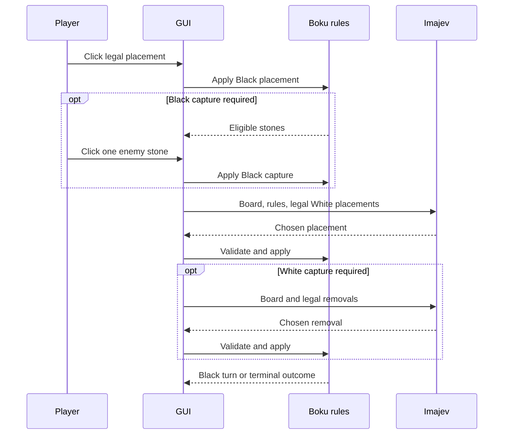

# Boku: second-game implementation plan

Status: prepared for implementation; Boku is not yet playable in the app.

Add Boku alongside tic-tac-toe, using the existing managed Imajev service, background inference queue, session storage and inline Diagnostics. Present Boku as a physical board with shaded black and white marbles. Human players click spaces to place stones rather than drawing them. Tic-tac-toe keeps its drawing interaction.

## Rules and explicit conventions

Reference: [Rules of Bōku](https://boku.bandoodle.co.uk/rules.html), including the board and sandwich illustrations. The source describes an 80-space hexagonal board, 36 marbles per player, Black moving first, and five **or more** adjacent marbles in a straight line winning. There are three undirected line axes.

When placement sandwiches exactly two enemy stones between friendly endpoints, the mover must remove **one** eligible enemy stone and return it to its owner's reserve. A double sandwich expands the eligible set; it does not permit removing one stone per sandwich. The removed space is forbidden to the opponent for their next turn only. Sandwiches of one or three enemy stones do not capture.

Use these documented app conventions where the published rules leave details open:

- Human is Black; Imajev is White. Black starts every new Boku game. Do not alternate starters as tic-tac-toe does.
- Adopt the published suggestion that exhausting either player's 36-stone reserve ends the game in a draw. Resolve mandatory capture and a possible win before checking exhaustion.
- Resolve a mandatory capture before declaring the placement turn complete, including when placement forms a winning line. The opponent never acts between placement and capture.
- Detect newly formed sandwiches involving the placed stone as an endpoint; existing board patterns do not independently trigger captures.
- Do not add repetition draws or a move limit. Reserve returns can allow long games. No move is legal after a terminal result.

These conventions should appear in the Boku help text and be versioned with the rules, so saved games can be replayed consistently.

## Board geometry and coordinates

Add `app/games/boku/geometry.py` as the single source of truth for the 80 playable locations, axial coordinates, six neighbor directions, three line axes, normalized centers and hit testing. Transcribe the board outline from the referenced diagram and verify its shape before committing the coordinate map; do not substitute a regular 91-space hexagon.

Assign stable printed IDs, for example row letters with left-to-right position numbers. Store the full ID-to-axial mapping explicitly or generate it deterministically. Printed IDs, prompts, action IDs, hit testing and replay must share this mapping. Include an annotated board in the implementation documentation so a human can audit it.

Test that there are exactly 80 unique spaces, all intended neighbors are reciprocal, straight-line steps remain collinear in screen coordinates, and border spaces have the expected neighbors. Hit testing uses a fraction of nearest-neighbor spacing and rejects clicks in gaps or outside the board.

## State and authoritative rules

Add `app/games/boku/game.py`, implementing the existing `Game` interface, with immutable state:

| Field | Purpose |
| --- | --- |
| Board | Occupant of each stable location: empty, Black or White |
| Current player | Mover; remains unchanged during required capture |
| Phase | Placement or capture |
| Capture candidates | Exact eligible removal locations for the pending placement |
| Forbidden space | Previous turn's removed location, forbidden during current placement |
| Reserves | Remaining black and white marbles, initially 36 each |
| History and revision | Accepted actions in order, including removal actions |
| Starting player | Black, retained for generic session displays |

Legal placement actions are `place_<cell>`. Legal removal actions are `capture_<cell>`. A placement consumes one reserve marble. A removal returns one marble to the opposing reserve. A capture action ends the same player's turn and sets the forbidden space for the opponent. A placement without capture ends the turn and clears the previous forbidden space. The previous prohibition expires after placement; preserve enough state to validate and resume an unfinished capture.

Check terminal outcomes only after a complete turn. Keep revision semantics consistent with the existing controller: each accepted action increments revision, even though a placement followed by capture comprises one turn. Present action history grouped into turns for humans. Validate phase, turn ownership, reserves, prohibition and capture candidates by replay when decoding records; never trust a serialized board alone.

## Stone rendering and human interaction

Extend `Scene` in `app/core/contracts.py` with optional stone and board-pocket primitives, keeping defaults so existing tic-tac-toe scenes remain valid. In `app/ui/rendering.py`, paint stones with Qt radial gradients, a thin rim, an off-center highlight and a subtle offset shadow. White stones need a visible edge against the board; black stones need a charcoal highlight. Paint shallow pockets on a warm board surface, sized to leave each printed coordinate readable.

Use these same scene primitives for the GUI and `observation_png`. The model must see the same occupied locations as the player. Keep authoritative ownership in the symbolic prompt. No raster assets or image-generation dependency are necessary for these geometric pieces.

Introduce a game input capability, such as `input_mode = 'drawing' | 'placement'`, and a game-owned point-to-action method. The canvas retains its current drawing path for tic-tac-toe. In Boku it emits a selected action from a click, without generating strokes or making a recognition call. Show a hover preview only on a legal space. During capture, highlight eligible enemy stones and explain that exactly one must be removed. Mark the forbidden empty space with a distinct ring and legend; do not display it as a third player's stone.

Add a controller entry point for direct human actions. It must check that the controller is editable, the game uses direct input, the human owns the turn, and the action is currently legal. Record the accepted action, player and pre-action state, then use `_after_move()` so capture remains a human phase or launches a second computer decision as appropriate. Invalid clicks leave state unchanged. Disable input while inference or service work is active.

For the initial implementation, a legal click commits immediately. Hide drawing-only Submit, Undo stroke and Clear controls for Boku. Do not imply that moves can be undone after submission.

## Imajev requests and lifecycle

Imajev remains the opponent. Use its existing choice-question decision head and shared process; no new coach, search engine or language-generation opponent is needed.

For placement, ask one `move` question with one choice per legal space. Include:

- Complete symbolic board and ID-to-axial coordinates, with the image as a visual aid.
- Current player, phase, reserves and forbidden space.
- Five-or-more win condition and exact sandwich/capture rule.
- A concise accepted turn history, bounded independently of the authoritative board.

For capture, ask the same `move` question with only `capture_<cell>` choices, stating that exactly one eligible opposing stone must be removed. Do not enumerate placement/capture combinations in a single question: separate phases keep the choice set smaller and make the capture explicit.

Reject abstentions and illegal IDs. Retry rephrases the current question while preserving board, phase and choices. Reuse move sampling only over validated legal choices. Preserve raw replies and record the original top choice and selected action. A single legal capture may use the controller's existing forced-action path; it must retain a replayable event.

The existing startup path calls `recognition_request()` even for warm-up. Add an explicit optional game warm-up request/scene pair, with a fallback to the existing recognition warm-up for drawing games. Boku supplies a small, valid choice request for warming the model, without pretending it recognizes handwriting. Use that capability in both `_launch('startup')` and `_warmup_ready()`.

## Integration boundaries discovered in the repository

| Existing code | Required change |
| --- | --- |
| `app/core/registry.py` | Register Boku alongside tic-tac-toe |
| `app/config.py` | Accept Boku and its player settings; add `config.boku.yaml` using the current inference defaults |
| `app/core/session.py` | Direct human actions, explicit warm-up capability, fixed starter policy and game-scoped coaching capability |
| `app/ui/canvas.py` | Dispatch drawing or click input; hover, capture and forbidden-space feedback |
| `app/ui/window.py` | Derive title, player labels, accessibility text, input hints and controls from active game |
| `app/ui/rendering.py` | Paint pockets and realistic stone primitives in GUI and observations |
| `app/storage/session_store.py` | Preserve generic session envelope and record direct actions |

The current `coached` property depends only on `config.prompt_variant`, and coaching imports tic-tac-toe-specific analysis. Guard it with an explicit game capability. Boku must never use the tic-tac-toe strategy ledger, loss analysis, tactical guard or opening guidance. Disable its prompt-mode selector and explain that Boku uses its own rules prompt; retain the user's tic-tac-toe selection for switching back. Move variety remains available for Boku.

The current New game handler alternates starters, and several labels hard-code X/O. Make starter policy and labels game-specific. Select Boku before its first move without requiring an initial tic-tac-toe move; after play starts, use New game to switch games. Game switching must preserve the existing stale-response protection and serialize work behind an active inference request. Resumed games keep their recorded game and settings.

## Implementation order

1. Add and test geometry, immutable state, legal actions, capture choices, prohibition, reserves, wins and replay independently of Qt or model calls.
2. Add stone/pocket primitives and produce a standalone board preview containing both colors, a capture highlight and a forbidden-space marker.
3. Add input capabilities and direct-action recording to the controller and canvas, with a fake opponent through complete turns.
4. Generalize labels, starter policy, game switching, warm-up and coaching guards; register Boku and add its launch profile.
5. Add Boku decision/retry prompts, protocol tests and observation exports; measure serialized request size and latency with the full opening choice set.
6. Run the full existing suite and GUI smoke check, then exercise a live placement → capture → next-turn cycle and export/resume it.

## Acceptance and validation

- Exactly 80 spaces; five and overlines win on every axis; bent chains do not.
- Capture from each direction; double sandwich offers the union of eligible stones but removes exactly one; one/three enemy stones do not capture.
- Forbidden-space restriction applies to exactly the opponent's next placement, then expires; a new capture replaces it.
- Reserve consumption/return, exhaustion draw convention and win-before-draw ordering are reproducible.
- Human and computer both complete captures before the opponent moves. Single forced captures are recorded. Rejected moves and abstentions do not change state.
- Save/resume works during a pending capture, with an active prohibition, and after terminal outcomes. Tampered board, reserve or capture metadata is rejected.
- Stone centers, click targets and model observations agree through resize. Gaps/outside-board clicks do nothing. Input is disabled during service and inference work.
- Switching from Coached quoted to Boku never coaches or writes Boku games to the tic-tac-toe learning ledger. Switching back restores the selected tic-tac-toe mode. Black starts Boku consistently.
- Existing tic-tac-toe drawing, mode selection, retries, sampling, coaching and lifecycle tests remain green.
- Live smoke checks establish protocol compatibility and responsiveness, not good Boku playing strength. Record move latency and abstentions before evaluating the opponent's quality.

Completion means Boku is selectable, playable with realistic stones, authoritative about its rules, and resumable using the same managed service. Boku coaching and a stronger opponent are separate follow-up work.
