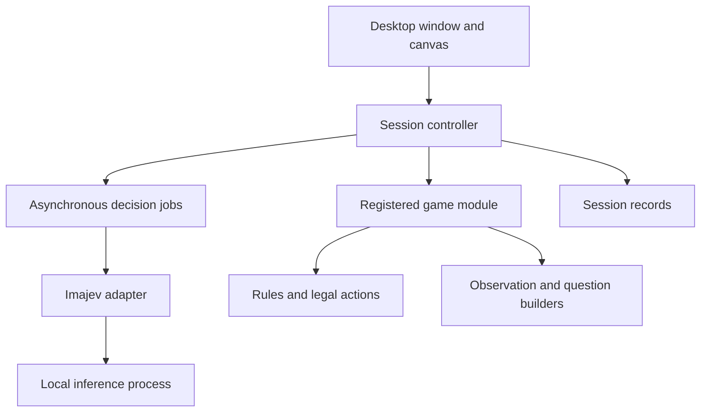

# Imajev drawing game design sheet

Version 1 • 3 October 2026 • Implementation proposal

Build a local desktop application where a person draws a move on a game board and plays against Imajev. The first release implements tic-tac-toe. Reusable game contracts separate the application shell, drawing tools, model integration and game rules so additional turn-based board games can be added without rewriting the application.

**Central decision:** Imajev interprets the drawing and selects the opponent’s move. A deterministic game engine owns the board, validates every move and declares the result. Model predictions never directly modify game state.

## 1 Scope and defaults

| Item | First release |
|---|---|
| Platform | Windows desktop GUI; local inference service, preferably in WSL2 on the existing NVIDIA setup |
| GUI | Python with PyQt6 and a custom QPainter canvas |
| Players | Human X against Imajev O; X starts |
| Input | Freehand mouse drawing, multiple strokes per move, explicit Submit |
| Model | Start by validating Imajev-2B on the 8 GB GPU; keep model selection configurable |
| Networking | Local service only; offline play after dependencies and model files are installed |
| Packaging | uv project with locked dependencies and config.yaml |
| Persistence | Versioned JSON game records and PNG observations; no pickle |
| Extension scope | Sequential, turn-based games with a finite set of legal actions |

The framework should not assume that every game uses X/O, nine cells or placement moves. Real-time games, hidden information, online multiplayer, imported photographs and training a model are outside the first release. A future game may require its own drawing tools and observation decoder.

## 2 Player experience

The main window has a game selector and New game at the top, a large square board in the centre, and a compact status panel beside it. Only Tic-tac-toe is enabled initially. The panel shows whose turn it is, the last accepted move and model status. A collapsible Diagnostics area contains probabilities and timings for experiments.

Under the board: **Undo stroke**, **Clear drawing**, **Submit move**. During recognition, show “Reading your move…”; during the computer turn, show “Imajev is choosing…”. The canvas must repaint and the window must remain usable during inference. New game remains available; submitting another move is disabled until the current operation ends.

1. Start with an empty board and “Draw an X in one empty cell.”
2. Draw an X using one or more strokes. Mouse release finishes a stroke, not the turn.
3. Submit the drawing. Freeze a snapshot and classify the pending ink.
4. If it is a clear X in one empty cell, commit the move and check the result.
5. If play continues, ask Imajev to choose an O move among legal cells.
6. Validate and draw the computer’s O, then check the result again.
7. On a win or draw, disable drawing, display the outcome and offer New game.

An ambiguous drawing stays editable. Display a specific message such as “I could not identify one X in one cell. Undo a stroke or clear and redraw.” Do not silently turn a scribble into a valid move. Drawing O while playing X produces a correction message. A model outage retains the game and pending strokes and offers Retry.

## 3 Canvas design

Maintain four distinct layers:

| Layer | Contents | Mutability |
|---|---|---|
| Board | Grid and small cell labels A1–C3 | Game renderer owns it |
| Committed marks | Accepted human strokes and computer marks | Changes only after a valid move |
| Pending ink | Current human strokes | Editable before acceptance |
| UI overlays | Hover, busy indicator, errors and winning line | Never included in model images |

Use columns A–C from left to right and rows 1–3 from top to bottom. Store stroke points in normalised board coordinates, from 0 to 1 on each axis, independent of window size and display scaling. A stroke includes its points, width and colour. Undo removes the last whole pending stroke. Losing mouse capture ends the current stroke cleanly; leaving the board clips ink to its drawable boundary.

Keep original human handwriting after acceptance. Render the computer’s marks as clean vector circles. Use shape as well as colour to distinguish players.

For recognition, render only the pending ink on a neutral labelled grid as a fixed 768 × 768 PNG. Do not include existing marks, cursors, selection highlights or instructions. The structured state tells the model what this image represents. This makes recognition independent of accumulated handwriting. For the opponent decision, render the committed board as a separate PNG and include the authoritative symbolic board in the request.

These image size and styling choices are proposed application defaults, not Imajev requirements. Test their effect on small and uneven marks.

## 4 Component architecture



| Component | Responsibility |
|---|---|
| Application shell | Game selection, configuration, lifecycle and common controls |
| Session controller | Turn state machine, immutable snapshots, request ownership and error recovery |
| Canvas | Input strokes and rendering; no inference or rule decisions |
| Game module | State, rules, drawing interpretation, legal actions, request construction and rendering |
| Imajev adapter | HTTP transport, schema checks, response normalisation and typed errors |
| Inference process | Loads model once and performs inference outside the GUI process |
| Session store | Optional local replay data and diagnostics |

Use an explicit in-process game registry in v1. No dynamic plugin loading or discovery framework is necessary. Register `tic_tac_toe` once; adding a game means implementing its contract and registering it.

### Suggested package layout

| Path | Purpose |
|---|---|
| `app/main.py` | GUI entry point and dependency wiring |
| `app/ui/window.py`, `canvas.py` | Common window and drawing widget |
| `app/core/contracts.py` | Shared immutable records and protocols |
| `app/core/session.py` | Turn lifecycle and response freshness |
| `app/core/registry.py` | Game registrations |
| `app/inference/imajev_client.py` | Local API adapter |
| `app/inference/jobs.py` | Nonblocking requests and cancellation bookkeeping |
| `app/games/tic_tac_toe/` | State, rules, rendering and Imajev prompts |
| `app/storage/session_store.py` | JSON and image records |
| `tests/` | Rules, lifecycle, protocol and recognition evaluation |
| `config.yaml`, `pyproject.toml`, `uv.lock` | Reproducible settings and dependencies |

## 5 Game contracts and state

Use typed protocols or abstract interfaces. Game state and action payloads remain game-specific; the shared controller treats them as opaque records.

| Interface operation | Contract |
|---|---|
| `initial_state(settings)` | Return a valid initial state |
| `current_player(state)` | Identify the player whose turn is next |
| `legal_actions(state)` | Return stable action IDs and descriptions |
| `apply_action(state, action)` | Validate and return a new state; never mutate on failure |
| `outcome(state)` | Ongoing, draw, or winner with optional winning geometry |
| `render(state, pending_ink, purpose)` | Produce scene layers or a model observation |
| `recognition_request(state, drawing)` | Build model questions and image |
| `decode_recognition(state, reply)` | Return a proposed action or a specific rejection |
| `decision_request(state, actions)` | Ask the model to choose among legal action IDs |
| `encode_state` / `decode_state` | Versioned serialisation and validation |

For tic-tac-toe, store nine values from `{empty, X, O}`, next player, move history and a monotonically increasing revision. `place_A1` through `place_C3` are stable action IDs. Check all eight winning lines after every accepted placement, before testing for a full-board draw.

Every inference job carries `session_id`, `state_revision`, `request_id` and `purpose`. Accept its result only if all four still match the active job and expected phase. New game generates a new session ID. Timeouts and cancelled jobs invalidate the request ID. A late response can therefore never place a mark in a new game.

## 6 Imajev integration

The upstream README documents local `POST /v1/systemone` calls, with a JSON `request` field plus an `image` file for multipart image requests. Choice answers include `choice`, `probabilities`, `unknown_probability` and `abstained`. Its published limits are 1–8 questions, 2–254 options and up to two images per request. Choice probabilities are conditional on the model answering. [1]

Keep all upstream details behind the adapter. Pin and record the upstream commit, model revision, adapter and calibration files; add a contract test against that exact installation.

### Human move recognition

Use two choice questions in one request. The image contains all pending strokes on the otherwise empty labelled grid. Do not send nine per-cell questions: that would exceed the documented question limit.

Example application request body, serialised into the multipart `request` field:

```json
{
  "state": {
    "game": "tic_tac_toe",
    "image_content": "Only the current player's pending ink on a labelled grid",
    "coordinates": "Columns A to C left to right; rows 1 to 3 top to bottom"
  },
  "questions": {
    "symbol": {
      "type": "choice",
      "instructions": "Classify all player ink together. Do not infer a symbol from the expected turn. Grid lines and printed labels are not player ink.",
      "criteria": {
        "X": "Exactly one recognisable cross",
        "O": "Exactly one recognisable circle",
        "invalid": "Blank, scribble, multiple symbols or no clear single symbol"
      }
    },
    "cell": {
      "type": "choice",
      "instructions": "Which single cell contains the complete player mark? Use invalid if it spans cells or there are multiple marks.",
      "criteria": {
        "A1": null, "B1": null, "C1": null,
        "A2": null, "B2": null, "C2": null,
        "A3": null, "B3": null, "C3": null,
        "invalid": "No unique cell contains the mark"
      }
    }
  }
}
```

For each question, define `effective_probability = probabilities[choice] * (1 - unknown_probability)`. Initially require at least 0.85 for both questions and `abstained == false`. This threshold is a tunable starting point, not validated accuracy on handwriting. The two scores are not a calibrated joint probability.

Before committing, require all of the following: symbol is X; cell is unambiguous; target is empty; it is the human turn; response is current. Independently check stroke geometry to reject substantial ink in multiple cells or outside the board. A proposed geometric tolerance is 95% of sampled stroke length within the predicted cell with a 2% board-width boundary tolerance. Evaluate and tune it on real drawings. Geometry validates location; it does not identify X/O or override the model.

### Computer move selection

Send the committed board PNG, the exact symbolic board, O as the current player, the coordinate convention and the game objective. Ask one `choice` question whose criteria are exactly the legal action IDs with readable cell descriptions. Instruct the model to seek a win and otherwise avoid losing.

Validate that the returned choice is an offered legal action and that the reply is current. Select its returned top choice. Move probabilities express model preference, not the probability of winning; do not apply the handwriting threshold to this task. Abstention, missing probabilities or an invalid ID pauses the computer turn and offers Retry.

If there is only one legal action, apply it deterministically and label it as a forced move in diagnostics; the endpoint requires at least two options. If there are none, resolve the terminal game without a model call.

Do not silently replace Imajev with minimax. Minimax belongs in evaluation as an oracle for immediate wins, necessary blocks and optimal-move agreement. Model skill is an experimental result, not a promised feature.

## 7 Turn lifecycle and failures

| Phase | Allowed actions | Exit |
|---|---|---|
| Loading | New game setup; no drawing | Service ready or visible startup error |
| Human drawing | Draw, undo stroke, clear, submit, new game | Submit nonempty ink |
| Recognising | New game; canvas read-only | Accept, return editable drawing, or error |
| Computer choosing | New game; canvas read-only | Valid computer move or error |
| Game over | New game | Reset |
| Error | Retry relevant operation or new game | Resume saved phase |

After accepting the human move, check for game over before starting the computer request. After accepting the computer move, check again before returning control to the user. A failed computer request must not undo or duplicate the human move.

Perform HTTP work asynchronously through Qt networking or a dedicated I/O worker. Keep model imports and GPU allocation out of the GUI process. Queue at most one inference job per session. Cancellation discards a result; it does not imply the server has stopped GPU work. Do not issue overlapping retries while the service is still busy.

Use separate startup and request timeouts. Proposed values: 180 s startup readiness budget and 30 s per warmed request. A timeout must never commit a move. Handle connection failure, HTTP error, malformed JSON, missing fields, nonfinite or invalid probabilities and GPU out-of-memory explicitly. No automatic cloud, CPU, different-model or missing-module fallback. Present an actionable error and retain the session.

## 8 Local runtime and configuration

The upstream project supplies a PyTorch image-serving path and an Imajev-2B model. [1] Use that supported path for the initial feasibility test. Running it in WSL2 is a proposed deployment choice; compatibility and peak memory on this particular RTX 3070 must be measured. Do not treat weight file size as total VRAM demand or assume a community GGUF conversion preserves the decision interface.

Keep the GUI and inference service in separate uv environments. The GUI needs PyQt6 and YAML configuration support; the inference environment owns the pinned Imajev dependencies, Torch and image stack. Prepare all required weights, tokenizer, processor, adapter and calibration assets before an offline test. Service startup must report missing assets without downloading during gameplay.

```yaml
game:
  default: tic_tac_toe
  human_symbol: X
imajev:
  endpoint: http://127.0.0.1:8765/v1/systemone
  expected_model: imajev-2b
  request_timeout_seconds: 30
  startup_timeout_seconds: 180
recognition:
  min_effective_probability: 0.85
canvas:
  observation_size_pixels: 768
diagnostics:
  enabled: false
  save_sessions: false
```

Bind the inference service to loopback. Verify Windows-to-WSL localhost access in the deployment check. Load the model once, run a warm-up image request, then enable play. Keep upstream launch arguments in a pinned deployment script; do not invent a universal launch command before confirming the selected revision.

## 9 Verification and acceptance

| Area | Required evidence |
|---|---|
| Rules | All eight winning lines, draws, occupied-cell rejection, turn order and terminal-state rejection pass; enumerate reachable states to check engine invariants |
| Canvas | Multiple strokes per X, undo, resize, display scaling, pointer leaving the board and capture loss behave correctly |
| Recognition | Evaluate at least 200 labelled drawings from multiple people; include neat/messy X/O, blank input, scribbles, double marks and boundary crossings; keep a held-out set for final results |
| Recognition metrics | Report accepted-move precision, acceptance coverage and false acceptance of invalid drawings separately; proposed goal ≥99% precision and ≥90% coverage on clear valid X marks |
| Opponent | Zero illegal committed actions; measure optimal-action agreement and missed wins/blocks against minimax on reachable O-turn states |
| Response lifecycle | Reset during inference, timeout then late response, double Submit and Retry never produce duplicate or stale moves |
| Offline operation | Complete a game with external network access disabled after setup |
| Hardware | Record cold start, warmed recognition and move p50/p95, peak VRAM and RAM on the target machine |
| Responsiveness | Drawing remains smooth; aim for <50 ms input-to-paint; proposed warmed model-request p95 target <3 s, subject to measured feasibility |
| Failure recovery | Service termination, malformed reply and out-of-memory retain the board and permit recovery without restarting the GUI |

Handwriting performance is the main feasibility risk. Upstream reports that its tracing-pad experiment can misread scribbles as letters; tic-tac-toe recognition has not been established by that result. [1] If the pilot misses the acceptance goals, revise rendering, prompts or model size explicitly and remeasure before proceeding. Never hide the failure behind automatic geometric symbol recognition.

## 10 Implementation sequence

1. **Feasibility spike:** run the local 2B image endpoint, measure memory, test representative X/O and invalid drawings, and confirm typed response parsing. Deliver a go/no-go result before building the full GUI.
2. **Rules and canvas:** implement tic-tac-toe state, rendering, pending strokes and controls. Use an explicit development fake for deterministic UI tests; it is never a runtime fallback.
3. **Recognition:** add image snapshots, the two-question request, confidence gating and actionable rejection messages.
4. **Opponent:** add legal-action questions, forced final move handling, response freshness and terminal-state checks.
5. **Hardening:** finish offline startup, timeout/retry behaviour, diagnostics and session export; run the acceptance matrix on the actual laptop.
6. **Extension check:** implement a tiny test-only second game module to prove the controller has no tic-tac-toe assumptions. Ship only tic-tac-toe in v1.

When diagnostics are enabled, save model and prompt versions, canonical board, offered actions, raw answer fields, decision durations, request identifiers and image/stroke references. Keep these records local. Export enough information to replay a recognition error independently of the GUI.

## 11 Sources and status

[1] [Imajev upstream repository and README](https://github.com/mohit67890/imajev), inspected 3 October 2026. Relevant sections: One request every answer typed, Quickstart, For developers, and Checked not cherry-picked. Model interface statements above derive from this source. Architecture, UI, thresholds, image dimensions, timeouts and performance targets in this sheet are proposed application decisions, not upstream guarantees.

This sheet specifies an implementation; it does not claim that a game prototype or target-hardware benchmark has already been completed.
