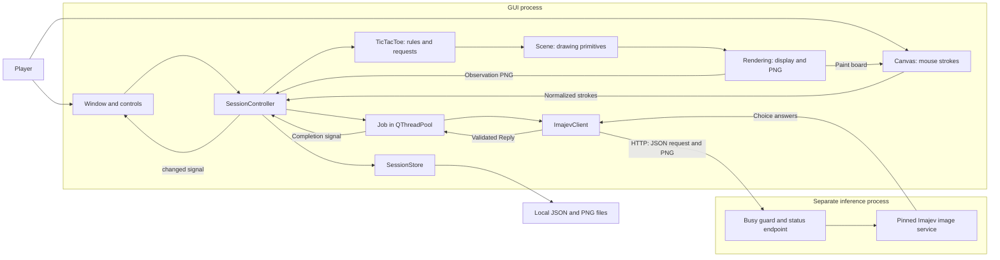
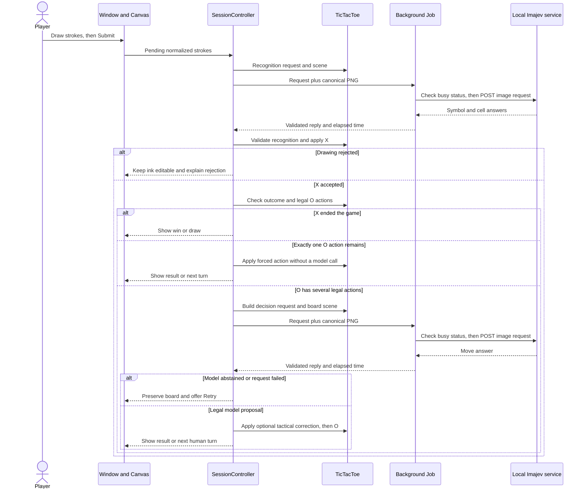
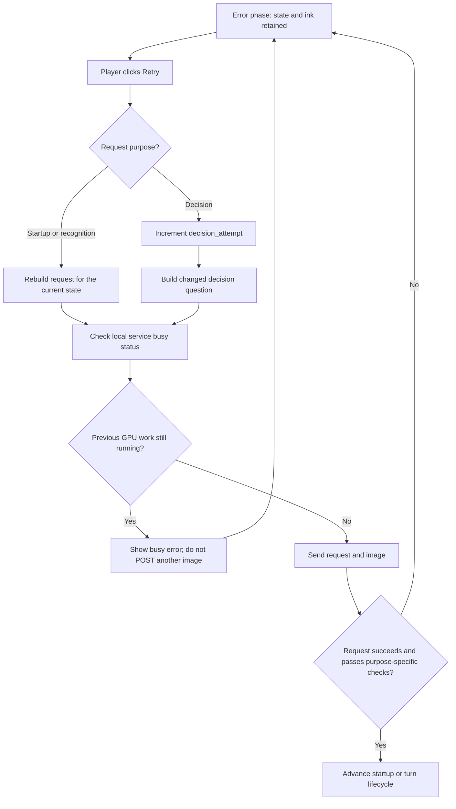
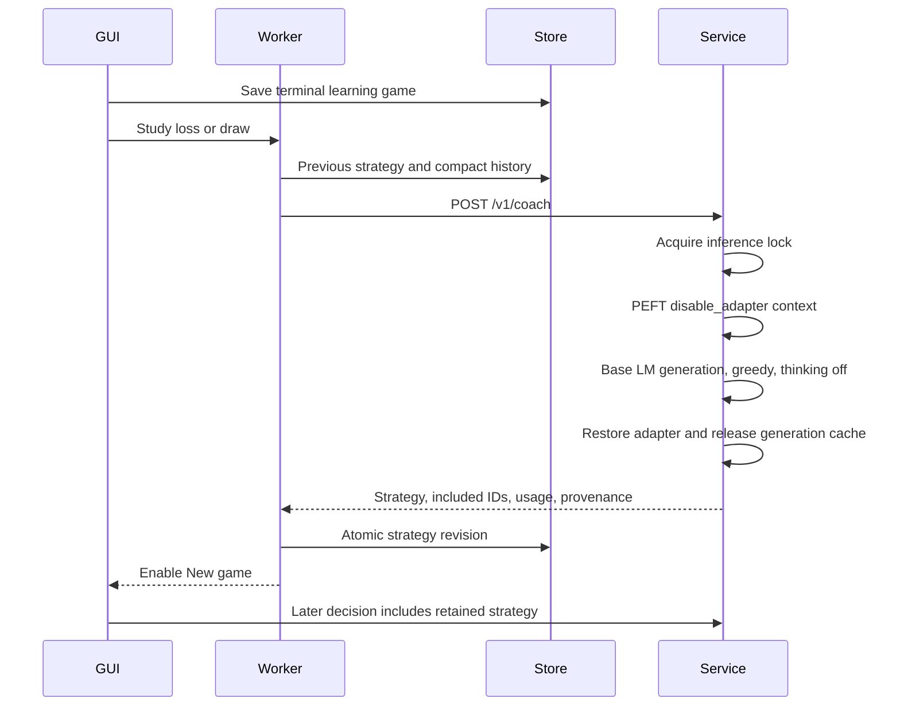
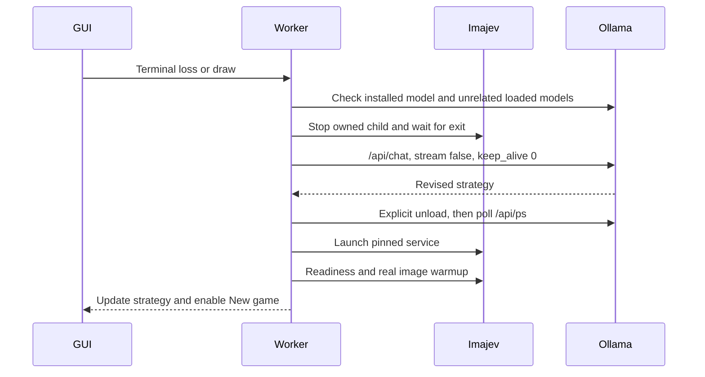
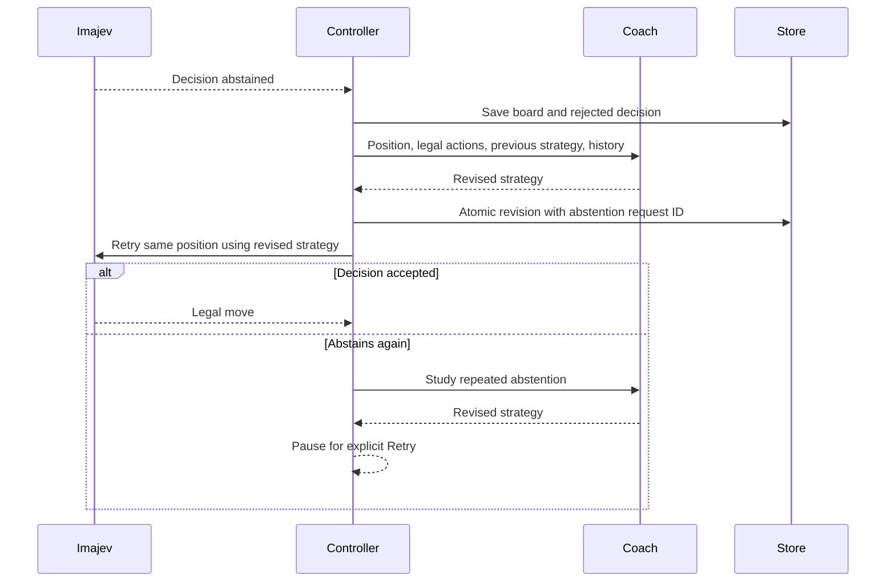

# Game implementation

This document explains the current Python/PyQt6 drawing game. It describes the code in this repository, including decision retries, optional opening advice, inline question diagnostics, and session resume. The original [game design](imajev_game_design.md) describes the product concept; this document describes the implemented behavior.

For installation and controls, see the [README](../README.md). For the separate model environment, see [local deployment](deployment.md).

## Architecture and ownership

The app has two processes: a lightweight desktop GUI and a local inference service. The GUI uses PyQt6, PyYAML, and httpx. It does not load Torch or model weights. The inference environment loads the pinned Imajev-4B adapter/readout with the Qwen3.5-4B base quantized to NF4 and receives requests over loopback HTTP.

The controller owns the active session. The game module owns the rules and canonical board. The model identifies handwriting and proposes a legal O action. A model answer changes the board only after protocol validation and game validation succeed.



`Scene` is the shared representation for both on-screen painting and inference images. Using the same scene renderer keeps the observations independent of the window size and avoids including controls or diagnostics in the model image.

### Source map

| File | Responsibility |
|---|---|
| [`app/main.py`](../app/main.py) | CLI arguments, configuration, logging, QApplication, optional restore, and window creation |
| [`app/config.py`](../app/config.py) | Typed configuration defaults and validation |
| [`app/core/contracts.py`](../app/core/contracts.py) | Game protocol and immutable data objects |
| [`app/core/registry.py`](../app/core/registry.py) | Available game implementations |
| [`app/core/session.py`](../app/core/session.py) | Turn lifecycle, jobs, reply acceptance, retry, and session publication |
| [`app/games/tic_tac_toe/game.py`](../app/games/tic_tac_toe/game.py) | Board rules, rendering scenes, recognition checks, and O prompts |
| [`app/ui/canvas.py`](../app/ui/canvas.py) | Pointer input and board painting |
| [`app/ui/rendering.py`](../app/ui/rendering.py) | QPainter rendering and canonical PNG generation |
| [`app/ui/window.py`](../app/ui/window.py) | Controls, status panel, inline Diagnostics, and export |
| [`app/inference/jobs.py`](../app/inference/jobs.py) | Background execution and completion signal |
| [`app/inference/imajev_client.py`](../app/inference/imajev_client.py) | Service readiness, HTTP calls, and reply validation |
| [`app/storage/session_store.py`](../app/storage/session_store.py) | Atomic JSON saves and observation files |
| [`scripts/serve_local.py`](../scripts/serve_local.py) | Busy gate and runtime provenance around the upstream service |

## Board, actions, and handwriting

The board is an immutable tuple of nine strings. Empty cells contain `''`; occupied cells contain `X` or `O`. Cells are ordered by row:

```text
A1 B1 C1
A2 B2 C2
A3 B3 C3
```

`State` also stores the next player, accepted move history, a revision number, and the starting player. The first game starts with the human X. Each click on New game alternates the starter within the current app run; Imajev remains O and may start a game. The right panel identifies who started. Old records without a starting player default to X. Resuming a game preserves its starter and makes the next new game start with the other player. `apply_action()` accepts only actions returned by `legal_actions()`, creates a new state, switches the player, and increments the revision. Legal action IDs look like `place_B2`. Completed games have no legal actions. The rules engine checks all three rows, three columns, and two diagonals for a win, then checks for a full-board draw.

Accepted X moves retain the original strokes in their history entry. O moves are rendered as circles at cell centers. Replay states without handwritten X strokes use symbolic crosses for display; this rendering does not classify a live drawing.

A `Stroke` contains points in board coordinates from 0 to 1, a width, and a color. Resizing the window changes only the mapping to pixels. Left-button presses inside the square board begin a stroke. Release, loss of mouse capture, or leaving the board finishes it. Boundary crossings are clipped to the board edge. Submit finishes any current stroke before sending the drawing; Undo and Clear affect pending strokes only.

## From a drawing to an accepted turn

Drawing is enabled only when `phase == 'human'` and no job is busy. Startup checks the loaded model and backend, then sends an actual image request to warm the image pipeline. An abstention on a blank warm-up image does not prevent readiness: startup requires a valid response, rather than a recognized X.



Recognition uses an image of the grid, printed cell labels, and pending ink only. Previously accepted moves are omitted so they do not confuse the new-symbol question. It asks two choice questions: `symbol` (`X`, `O`, or `invalid`) and `cell` (nine cells or `invalid`).

For each answer, the acceptance score is:

```text
effective_probability = selected_choice_probability × (1 − unknown_probability)
```

Both answers must be non-abstained and meet the configured threshold, which defaults to 0.85. The symbol must be X, the chosen cell must exist and be empty, and it must still be the human turn.

The geometry check then requires at least 95% of the stroke length to lie inside the chosen cell, allowing a 0.02 board-coordinate margin. It checks position, not whether the strokes form an X. Invalid geometry, low confidence, an O, or an occupied cell leaves the ink available for editing. Transport or protocol failures enter the error phase and offer Retry with the ink retained.

## How O chooses a move

The decision image contains accepted moves and no pending ink. Its JSON context includes the symbolic board, current player, coordinate convention, win condition, immediate O wins, and immediate X threats. The symbolic board is authoritative. The `move` question offers every legal action with a description such as `Place O in B2`.

There are three distinct forms of assistance:

| Mechanism | Behavior |
|---|---|
| Opening suggestion | When O starts, recommends B2. When X starts, recommends A1 after X opens at B2; otherwise recommends B2. Enabled by default. |
| Tactical prompt | Explicitly requests the required move when there is exactly one immediate O win or unique X block. This remains in the prompt even if the commit-time guard is disabled. |
| Tactical guard | After a non-abstained legal proposal, commits an immediate O win or unique X block if the model missed it. Enabled by default. |

The guard first considers immediate O wins. Otherwise, it blocks X only when exactly one empty cell would let X win next turn. It cannot block two distinct winning cells in one move and does not solve forks or search future turns. If several immediate O wins exist and the model proposes another move, the guard uses the first winning action in cell order.

Corrections record `model_proposed_action`, `accepted_action`, and `tactical_correction`. The last accepted move is marked `tactical rule`, and Diagnostics explains the change. An abstained answer is rejected before the guard runs. Decision answers have no 0.85 recognition threshold; their displayed score is the model's conditional preference among the offered actions.

[`config.no-opening.yaml`](../config.no-opening.yaml) disables only opening advice. It retains tactical prompts and the tactical guard. Disabling the guard removes commit-time correction but does not remove tactical or opening advice from the request.

## Retry and asynchronous state

The GUI thread performs input and state changes. HTTP operations run in a `Job` through a `QThreadPool` with one worker. The completion signal returns the ticket, reply or error, and elapsed time to the controller.

Each ticket identifies the session, board revision, request, and purpose. The controller accepts a completion only if it matches the in-flight request, active ticket, session, revision, and expected phase. New game invalidates the active ticket and replaces the session. It does not cancel GPU work; a new request waits for the old worker to finish. Closing during inference hides the window and waits for the worker before completing the close.



Decision retries change the question rather than automatically repeating an identical prompt. A unique tactic or enabled opening suggestion supplies the requested candidate. With opening advice disabled on the first O turn, retries alternate between two neutral instructions, without naming a preferred cell. In later positions without a unique tactic, retries suggest B2 if it is legal; otherwise they cycle through legal actions. They also record `retry_attempt` in the request. This can affect the model's choice, and it does not guarantee that the model will stop abstaining.

The client checks `/v1/status` before posting. The supplied service wrapper also rejects overlapping inference calls with HTTP 409. After a timeout, the client treats the service as potentially still busy until status confirms otherwise. An unguarded server without the status endpoint supports ordinary requests, but safe retry after a timeout requires the guarded launcher.

## HTTP contract

The configured endpoint defaults to `http://127.0.0.1:8765/v1/systemone`. Configuration accepts HTTP loopback URLs without credentials, query strings, or fragments. The client sends multipart data containing a JSON `request` field and an `image` PNG file. It disables environment proxy settings for inference calls and does not follow their redirects.

Before enabling drawing, `/v1/models` must report the configured model, `loaded: true`, and `backend: torch`. Reply validation requires:

- The expected model ID and a choice answer for each requested question.
- Probability keys matching the offered choices exactly.
- Finite probabilities in the range 0–1, summing to one within 0.02.
- A selected choice with the highest probability, allowing a small numerical tolerance.
- A valid unknown probability and boolean abstention field.

HTTP failures, malformed JSON, model mismatches, timeouts, busy responses, and reported GPU memory failures become visible errors. Gameplay has no substitute model or handwriting detector. The upstream commit, adapter version, and available service runtime metadata are retained for inspection.

## Diagnostics, saving, and resume

Diagnostics stays inline below the drawing controls. It shows the latest timing and scores, plus the question history newest first. History entries include question instructions, choice IDs, retry numbers, and results. Full criterion descriptions and symbolic request context are available in the session JSON. The side panel wraps status text, reserves height for the message, and scrolls when its contents exceed the available space.

Automatic saving is optional. With `diagnostics.save_sessions: true`, each session directory contains `session.json` and request observation PNGs. JSON is written to a temporary file and replaced atomically. Completed inference events retain their state snapshot, drawing, request, offered actions, prompt version, reply, duration, error or rejection, and accepted action. Forced moves use a smaller event because no model request exists.

The top-level record includes model and adapter identifiers, the recognition threshold, opponent settings, canonical state, pending ink, and event history. Completed transitions and request lifecycle updates publish the session. Editing pending ink emits a UI update; it does not immediately save every pointer movement.

Export creates a standalone JSON file with embedded observation images. Resume replays and validates the saved accepted history, checks it against the stored board, restores pending ink and events, and creates a new session with `source_session_id`. It warms the service before continuing; a restored O turn resumes automatically. A completed restored game stays completed. Resume uses the current configuration rather than automatically restoring saved opponent settings.

```sh
uv run --locked imajev-game --debug-input
uv run --locked imajev-game --config config.no-opening.yaml --debug-input
uv run --locked imajev-game --resume sessions/SESSION_ID/session.json --debug-input
```

## Configuration and verification

| Setting | Default | Effect |
|---|---|---|
| `game.default` | `tic_tac_toe` | Registered game |
| `opponent.tactical_guard` | `true` | Commit-time immediate-win/block correction |
| `opponent.opening_suggestion` | `true` | Guidance on the first O move and its retries |
| `imajev.expected_model` | `imajev-4b-nf4` | Required response model ID |
| `imajev.request_timeout_seconds` | `45` | Inference request timeout |
| `imajev.startup_timeout_seconds` | `300` | Readiness and image warm-up budget |
| `recognition.min_effective_probability` | `0.85` | Required symbol and cell scores |
| `canvas.observation_size_pixels` | `768` | Square observation resolution |
| `diagnostics.enabled` | `false` | Initially expand inline Diagnostics |
| `diagnostics.save_sessions` | `false` | Automatic JSON and PNG persistence |
| `diagnostics.directory` | `sessions` | Save directory, relative to the configuration file |

`--debug-input` enables detailed local mouse logging, expands Diagnostics, and enables automatic session saving. The default log is `logs/input-debug.log`, with rotation at 2 MB and two backups. `--log-file` overrides its location.

The test suite covers reachable-board rules, recognition/protocol checks, tactical corrections, input resizing and capture, storage, stale replies, retries, resume, and the side-panel layout with inline Diagnostics. It uses fake inference clients to test application behavior. Those tests do not measure the model's playing strength or handwriting accuracy.

[`scripts/evaluate.py`](../scripts/evaluate.py) supplies contract, recognition, and opponent evaluations. Its minimax oracle is used for evaluation and tests, not as the live opponent. [`scripts/replay_recognition.py`](../scripts/replay_recognition.py) replays saved requests, optionally preserving the original prompt. See [evaluation status](evaluation/STATUS.md) for measured results and their limits.

## Adding another game

Implement the `Game` protocol in `app/core/contracts.py` and register the implementation in `app/core/registry.py`. The controller expects the game to supply states, legal actions, outcomes, scenes, model requests, answer validation, and state serialization. Optional capabilities such as `retry_decision_request`, `tactical_choice`, and `supports_opening_suggestion` are discovered separately.

Games can optionally implement `initial_state_for_player(player)` to support alternating starters. The UI requests alternation with `new_game(alternate_starter=True)`; direct controller resets default to the human starter.

The controller is tested with a small second game, but the current window still contains tic-tac-toe-specific labels and instructions. Adding a production game also requires adapting those UI elements and providing its own rule, rendering, protocol, and lifecycle coverage.

## Persistent strategy learning

`SessionController` snapshots learning mode and the current strategy at New game. Learning prompts use `TicTacToe.learning_request`, which contains no computed tactical advice; recognition and rules validation are unchanged. A terminal loss or draw triggers a serialized worker after saving history. Learning-mode decision abstentions also trigger coaching before the game finishes; the request includes the current board, legal actions and abstention details. Recognition abstentions continue to ask for a redraw. Wins are saved without terminal coaching. Resume retains the logical session ID and strategy snapshot. The atomic strategy ledger records terminal game IDs and separate abstention request IDs, preventing duplicate successful updates while allowing later loss/draw coaching for the same game.

`LearningStore` writes resumable records and compact accepted move summaries under `learning/`, independently of diagnostics. Coaching includes the previous strategy, cumulative completed outcomes, the triggering game first, and other completed learning games newest first. The unfinished triggering game is included for abstention recovery, but it does not count toward completed outcome statistics. A conservative byte cap bounds client requests; shared coaching trims older games against the actual 3,072-token tokenizer budget and returns the included IDs. Revisions, their requests and responses share one atomic ledger replacement. Failed attempts retain the old revision.



The [PEFT context manager](https://huggingface.co/docs/peft/package_reference/peft_model#peft.PeftModel.disable_adapter) restores the adapter when generation returns or raises. The trained decision readout remains separate from the ordinary generation head. Both POST endpoints share the busy gate and model lock.

`ServiceManager` launches the existing offline pinned launcher and checks child exit during readiness polling. The controller uses one Qt worker pool thread for inference and coaching. An existing listener is reported; external mode never starts or stops it. Ollama mode requires process ownership and an installed configured model.



The [Ollama chat API](https://docs.ollama.com/api/chat) and [running-model API](https://docs.ollama.com/api/ps) support the swap. Unconfirmed unloading blocks restart, including Continue. Inline Diagnostics retains requests, responses, timings and errors. Failure leaves New game disabled until Retry succeeds or Continue confirms Imajev readiness. No GPU transition runs in a gameplay GUI slot.

The repeatable live acceptance command is `QT_QPA_PLATFORM=offscreen uv run python -m scripts.verify_learning`. It owns its service, records revisions under `logs/learning-validation/`, and plays real computer turns after two synthetic losses. See [measured acceptance](evaluation/learning.md) for results and limitations. Ollama uses a conservative 2,500-byte history request cap to reserve space in its context without installing another tokenizer; shared coaching uses the loaded tokenizer for exact input budgeting.

After successful abstention coaching, the controller saves the current strategy and its update at the board revision, then retries the computer decision once automatically. Repeated abstention triggers another coaching request and then pauses for explicit Retry. The initial game strategy remains recorded separately; restored games use the latest effective strategy. The original board remains intact on coach failure. Retry coaching reuses the failed request's update ID; Continue confirms readiness and resumes the same turn with the previous strategy.


